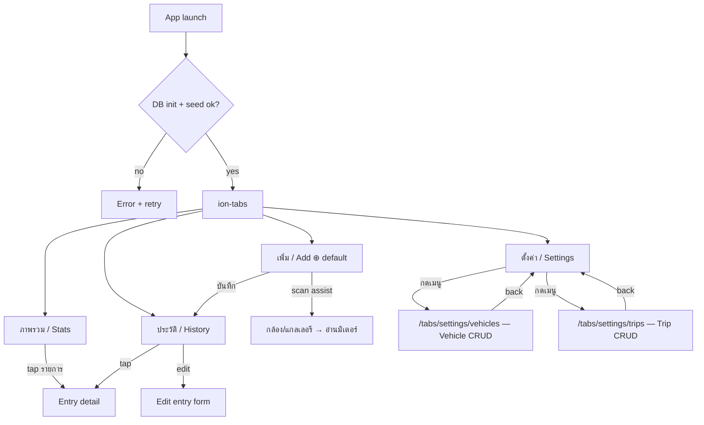

# Flow — App Navigation / Information Architecture

โครงสร้าง navigation ของแอป (Ionic `ion-tabs`) และการ map แต่ละแท็บเข้ากับ FR ใน
[[SRS-fuel-log]]. เอกสารนี้เป็น IA แม่ — flow ย่อยรายหน้าจอ (`[[FLOW-add-fuel-entry]]`,
`[[FLOW-overview-reports]]`) แตกออกไปต่างหาก.

## 1. Purpose

ผู้ใช้เปิดแอปแล้วเข้าถึงงานหลักทั้ง 4 ได้จาก bottom tab bar ทันที โดยไม่ต้องเรียนรู้:
ดูภาพรวม · เพิ่มการเติม · ดูประวัติ · ตั้งค่า. แท็บกลาง (เพิ่มการเติม) คือ primary action.

## 2. Actors

- Primary: เจ้าของรถส่วนตัว (single user, ไม่มีบัญชี — ดู [[PRD-fuel-log]] §3)
- Secondary: คนมีหลายคัน, คนเดินทางเป็นทริป

## 3. Pre-conditions

- ฐานข้อมูล SQLite init + seed master config สำเร็จ (FR-010, FR-011). DB init fail →
  หน้า error + retry (ดู [[SRS-fuel-log]] §7), ไม่เข้าหน้า tab.

## 4. Navigation map

`ion-tabs` + `ion-tab-bar` (slot="bottom"), 4 แท็บ. แท็บกลาง "เพิ่ม" = default landing.

> **หมายเหตุ IA (อัปเดต 2026-07-05, plan `[[2026-07-05-1940-settings-cleanup]]`):** VEH/TRIP เป็น **nested child route** ใต้แท็บ Settings (`/tabs/settings/*`) ไม่ใช่แท็บระดับบนสุด — กดปุ่มในหน้า Settings แล้ว push เข้า sub-page, **tab bar ยังแสดงอยู่**, กด back กลับมาหน้าเมนู Settings (T4) ได้ตามปกติ. หน้า Settings เองไม่มี CRUD inline อีกต่อไป — ดู §5. เดิมมี route `/tabs/settings/master-data` (Brand/FuelType read-only view) ด้วย แต่ถูกลบทิ้งทั้งหมด (plan `[[2026-07-05-1940-settings-cleanup]]`) — brand/fuel type ยังใช้เป็น seed/picker data source ในฟอร์มเพิ่มรายการ (ดู [[SRS-fuel-log]] FR-005) เพียงแต่ไม่มีหน้า UI ให้ดูแยกอีกต่อไป.

### ลำดับแท็บใน bar (ซ้าย→ขวา)

`ภาพรวม · เพิ่ม(กลาง,default) · ประวัติ · ตั้งค่า`

> หมายเหตุการตัดสินใจ: [[PRD-fuel-log]] จัดให้ "กรอกเอง" (US1) = P1 และ "สแกน" (US5) = P2.
> ดังนั้นแท็บกลางคือ **เพิ่มการเติม** ที่มีโหมดกรอกเองเป็นหลัก + ปุ่มสแกนช่วยกรอก —
> ไม่ใช่แท็บ "Scan" ล้วน.

## 5. แต่ละแท็บ → FR / หน้าจอ

### Tab 1 — ภาพรวม (Stats)  ← FR-008, FR-007
- Overview reports: สรุป ราย trip · เดือน · รถ (FR-008)
- ตัวชี้วัด: ยอดรวม ฿, จำนวนครั้ง, ลิตรรวม, ฿/ลิตรเฉลี่ย, กม./ลิตร (derived ระดับกลุ่ม, FR-007)
- `ion-segment` เลือกมิติ (trip / เดือน / รถ); วิช่วลเริ่มจาก list/bar ง่ายๆ (ไม่ดึง chart lib หนัก)
- รายละเอียด: [[FLOW-overview-reports]]

### Tab 2 — เพิ่ม (Add, center, default)  ← FR-001, FR-006, FR-005, FR-004
- ฟอร์มกรอกเอง (P1, FR-001): liters · price_per_liter · amount (**3 ตัวอิสระ ไม่บังคับ
  invariant** — FR-020 ถูกตัดออก, Clarify 2026-06-29 Q4) + datetime
- เลือก vehicle (optional), brand/fuel_type จาก master picker read-only (FR-005)
- odometer_km (optional, FR-007); station/note (optional)
- ปุ่ม "สแกนช่วยกรอก" (P2, FR-006): กล้อง/แกลเลอรี → CRNN อ่าน amount/liters/price → เติม
  ลงฟอร์มให้แก้ได้ → fallback manual ROI ถ้า auto-detect พลาด (ดู [[FEAT-MeterScan]])
- บันทึก → เขียน FuelEntry (SQLite, FR-010) → กลับ/ไป History เห็นรายการบนสุด
- รายละเอียด: [[FLOW-add-fuel-entry]]

### Tab 3 — ประวัติ (History)  ← FR-002
- `ion-list` รายการ FuelEntry จัดกลุ่มตามเดือน; `ion-item-sliding` แก้/ลบ (FR-002)
- filter ตาม vehicle / trip
- tap → detail (รวมรูปจาก image_uri ถ้ามี) → แก้ได้

### Tab 4 — ตั้งค่า (Settings)  ← FR-003, FR-004, FR-005, FR-011

> **อัปเดต 2026-07-02** (plan `[[2026-07-02-1526-settings-subpages-darkmode]]`): หน้า Settings เปลี่ยนจาก CRUD inline (list + modal ในหน้าเดียว) → เป็น **เมนูปุ่ม** ที่ navigate ไป sub-page แยกต่างหาก. CRUD logic เดิมย้ายไปอยู่ที่ sub-page ตามลิงก์ด้านล่าง; หน้า Settings เองเหลือแค่เมนู + section การแสดงผล + section ทั่วไป

- หน้า Settings เอง = รายการปุ่มเมนู (ion-item + navigate), ไม่มี ion-modal/CRUD inline อีกต่อไป; กดปุ่ม → push sub-page ใน tab's route (`/tabs/settings/...`), tab bar ยังอยู่, back กลับหน้าเมนูได้
- **รถของฉัน** → `/tabs/settings/vehicles`: Vehicle CRUD เต็มรูปแบบ (list + add/edit modal + delete confirm) (FR-003) — ย้าย logic มาจากหน้า settings เดิม
- **ทริป** → `/tabs/settings/trips`: Trip CRUD + ผูก entry (FR-004) — list ทริป, สร้าง/แก้/ลบ, ดู summary ราย trip — ย้าย logic มาจากหน้า settings เดิม
- **การแสดงผล** (section ใหม่ อยู่ในหน้า Settings เอง — ไม่ใช่ sub-page แยก): toggle dark mode แบบ 2-state (สว่าง/มืด), persist ผ่าน Capacitor Preferences (key `theme`), apply ตอน app start — *ยังไม่มี FR รองรับใน [[SRS-fuel-log]], ดู §9 Doc gaps*
- about/เวอร์ชัน, สถานะ seed (FR-011) — ยังอยู่ในหน้า Settings เอง (ไม่ย้าย). (Export ข้อมูล/ล้างข้อมูล placeholder และเมนู "แบรนด์และประเภทน้ำมัน" → `/tabs/settings/master-data` ถูกลบทิ้งทั้งหมด — plan `[[2026-07-05-1940-settings-cleanup]]`; brand/fuel type ยังใช้เป็น seed/picker data source ใน [[SRS-fuel-log]] FR-005 ผ่านฟอร์มเพิ่มรายการเท่านั้น ไม่มีหน้า UI ให้ดูแยกอีกต่อไป)

## 6. Post-conditions / Success

- ผู้ใช้สลับ 4 แท็บได้ทุกทิศ, แท็บกลางเปิดเป็นค่าเริ่มต้น
- การบันทึกจากแท็บ "เพิ่ม" ทำให้รายการใหม่โผล่บนสุดใน "ประวัติ" และสะท้อนใน "ภาพรวม"

## 7. Error paths

- DB/seed init fail → หน้า error + retry, ไม่เข้า tabs (FR-010/011, [[SRS-fuel-log]] §7)
- image_uri ชี้ไฟล์หาย → แสดง placeholder, ไม่ crash

## 8. Variations

- ไม่มีรถเลย → vehicle picker ว่างได้ (entry ไม่ผูกรถก็บันทึกได้, vehicle_id optional)
- ไม่มีทริป → entry ไม่ผูกทริป

## 9. Open questions / doc gaps (ต้อง /ow-clarify ก่อน lock)

1. **Active trip UX** — ใน session ออกแบบนี้ผู้ใช้อยากได้ปุ่ม "เริ่มทริป/จบทริป" + banner
   ทริป active บนแท็บเพิ่ม (entry ที่บันทึกตอนนั้น auto-tag trip). FR-004 ปัจจุบันระบุแค่
   Trip CRUD + ผูก entry ด้วยมือ. → ส่วน active-trip/banner/start-end เป็น **ส่วนขยาย FR-004**
   ที่ยังไม่อยู่ใน SRS. ต้องยืนยันก่อนทำ.
2. **image_uri** — SRS §5 ระบุ `image_uri = temp path`; แต่ผู้ใช้อยากให้ตอนถ่ายเซฟลง
   แกลเลอรีของเครื่องแล้วเก็บลิงก์. → ขัดกัน, ต้อง clarify (temp path vs save-to-gallery).
3. แท็บกลางใช้ชื่อ "เพิ่ม" (manual P1) หรือ "สแกน" (ตามชื่อแอปเดิม)? ปัจจุบันเลือก "เพิ่ม".
4. **Dark mode toggle** (เพิ่มโดย plan `[[2026-07-02-1526-settings-subpages-darkmode]]`, §5 Tab 4) — ไม่มี FR รองรับใน [[SRS-fuel-log]]. SRS มี stub FR-012 (status: gap, ยังไม่มี acceptance) — ต้อง `/ow-clarify` ก่อนถือเป็น contract ที่ล็อกแล้ว.
